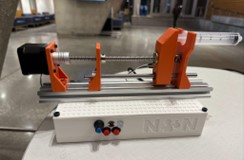
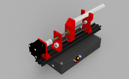
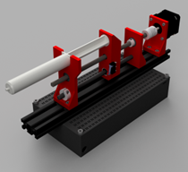

# SyringePumpProject
This repo goes over a project I worked on alongside a team to create and operate a syringe pump project.

## Operating the Syringe Pump:
1.	Fill the syringe with the desired volume of liquid.
2.	Plug the power supply into an outlet to provide AC input to the board.
3.	Connect the microcontroller to the computer with the Arduino code via a USB-B port.
4.	Use the backward motion button to retract the carriage far enough to accommodate the length of the chosen syringe.
a.	The LED light will be green while in motion and can be double-clicked to pause the motion in either direction (yellow)
5.	Insert the syringe wings into the syringe end support slit (orient the syringe facing away from the motor).
6.	Use the forward motion button to align the carriage with the end of the syringe plunger.
7.	Specify the syringe size and requested flow rate in the Arduino code.
8.	Press the forward motion button to begin the motion of the carriage against the plunger to start pushing fluid out of the syringe barrel at a constant rate. 
9.	The potentiometer can be used to update the flow rate manually and the exact flow rate can be viewed through the serial monitor on the computer.
10.	Once the plunger reaches the end, the limit switch on the carriage will be activated and the motion will stop—indicated by a red LED light.
11.	The syringe can be removed and the carriage can be moved back using the backward button.

## Off-the-shelf parts:
| Parts | Quantity |
| ------ | ---------- |
| 250 mm lead screw with 2 mm pitch and 2 mm lead | 1 |
| 1/4" x 8 mm Flexible Coupling | 1 |
| 200 mm linear rod with 8 mm diameter | 2 |
| LM8UU Linear bearing for 8 mm diameter rod | 2 |
| 2040 Aluminum Extrusion 1' Length | 1 |
| Nema 17 Stepper Motor | 1 |
| MEAN WELL RQ-65D AC-DC Power Supply Quad Output 5V 12V 24V 12V 4 Amp | 1 |
| Arduino Uno | 1 |
| A4988 Stepper Driver | 1 |
| Small Breadboard | 1 |
| Panel Mount Latching Push Buttons | 1 |
| Panel Mount Momentary Push Buttons | 1 |
| Limit Switch | 1 |
| RGB Common Cathode LED | 1 |
| Wires, Fasteners, Resistors | X |

## Parts that were 3D printed:
| 3D printed parts | Material |
| --- | --- |
| Carriage | ABS |
| End Support | ABS |
| Motor Mounting Plate | ABS |
| Enclosure Base | PLA |
| Enclosure Lid | PLA |

The motor mounting plate is printed in ABS because of its strength and higher melting point that accommodates the weight and high operating temperature of the motor. The carriage and End support was also printed in ABS because they were printed together, though they aren't as important to be printed in ABS as compared to the motor mounting plate. 

## Gallery:

